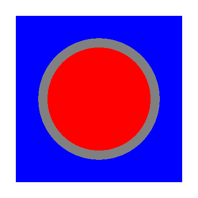
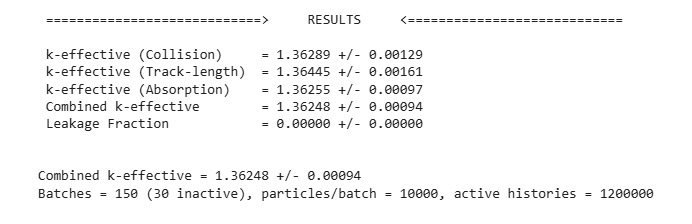

# Nuclear Reactor Simulations using OpenMC

Monte Carlo neutron-transport calculations of nuclear reactor systems, written in Python with the [OpenMC](https://docs.openmc.org) code.

**Author:** Meesam Raza, BS Mathematics, transitioning into Nuclear Reactor Physics and Computational Simulations.

---

## Project 1: UO2 Fuel Pin-Cell Simulation

**File:** `openmc_uo2_pin_cell_simulation.py`

This script computes the effective multiplication factor (k-effective) of a single UO2 fuel pin surrounded by cladding and light water. Reflective boundaries on all four sides of the cell represent an infinite square lattice of identical pins, so the result corresponds to k-infinity.

### What the script does

1. Defines the materials (UO2 fuel, cladding, light water with thermal scattering data).
2. Downloads only the required nuclear cross sections automatically (`openmc_data_downloader`), so it runs on Google Colab or locally without manual data setup.
3. Builds the pin-cell geometry and exports `materials.xml`, `geometry.xml` and `settings.xml`.
4. Runs the OpenMC eigenvalue calculation.
5. Reads the final statepoint file, prints k-effective and saves it to `results.txt`.

All inputs are listed in one `PARAMETERS` block at the top of the script.

### Model description

| Component | Specification |
|---|---|
| Fuel | UO2, 3 atom % U-235 (about 2.96 wt %), density 10.5 g/cm³ |
| Fuel pellet radius | 0.39 cm |
| Cladding | Zirconium (simplified Zircaloy), outer radius 0.46 cm, density 6.6 g/cm³ |
| Moderator / coolant | Light water, density 0.74 g/cm³, with H-in-H2O thermal scattering |
| Lattice pitch | 1.26 cm (square lattice) |
| Boundary conditions | Reflective on all four sides (infinite lattice); infinite in the axial direction |

### Geometry



*Cross-section of the pin cell: fuel, cladding and moderator.*

### Results

Run settings: 150 batches (30 inactive), 10,000 particles per batch, which gives 1,200,000 active histories.

| Estimator | k-effective |
|---|---|
| Collision | 1.36289 ± 0.00129 |
| Track-length | 1.36445 ± 0.00161 |
| Absorption | 1.36255 ± 0.00097 |
| **Combined** | **1.36248 ± 0.00094** |

Leakage fraction is 0, as expected for a reflective boundary. The three estimators agree within their statistical uncertainties.



*Final part of the terminal output of the run.*

A shorter check run (100 batches with 10 inactive, 1,000 particles per batch, 90,000 active histories, about 14 seconds) gave a combined k-effective of 1.36426 ± 0.00285. It agrees with the longer run within the statistical uncertainty, and the longer run reduces the uncertainty by about a factor of three.

### How to run

1. Install OpenMC (the conda-forge package is recommended, see the [OpenMC install guide](https://docs.openmc.org/en/stable/usersguide/install.html)).
2. Install the data downloader: `pip install -r requirements.txt`
3. Run the script:

```bash
python openmc_uo2_pin_cell_simulation.py
```

The script writes the XML input files, the OpenMC output and `results.txt` in the working directory. The cross-section download needs an internet connection.

### Limitations

- No material temperatures are set, so OpenMC uses its default temperature for the cross-section data, while the water density (0.74 g/cm³) corresponds to hot operating conditions. This mixed state is a known simplification.
- The cladding is pure zirconium instead of a full Zircaloy composition (no Sn, Fe, Cr).
- The model is a single pin cell: no fuel-cladding gap, no burnable absorbers, no soluble boron, no fuel depletion.
- No tallies are defined yet, so only k-effective is reported.

### Planned extensions

- Enrichment sweep and its effect on k-effective.
- Fuel and moderator temperature and density effects (temperature coefficients).
- Neutron flux spectrum tally.
- Extension from a pin cell to a fuel assembly.
- Validation of the model against a published benchmark.

---

## Tools

Python, OpenMC, openmc_data_downloader

## About

Python scripts for neutron transport eigenvalue (k-effective) simulations using OpenMC.
